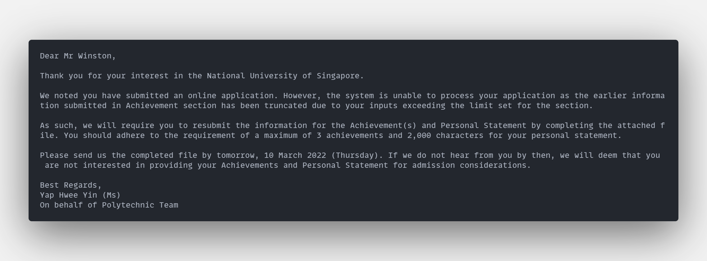

# nus-aba-plus

Browser extension for National University of Singapore's aptitude-based admissions application portal. This is the best way to get your application withheld for "technical reasons". Supports both Chromium and Firefox.

    

## Features

* Changes **Personal Statement** character limit from 2000 to 10000
* Add unlimited achievements
